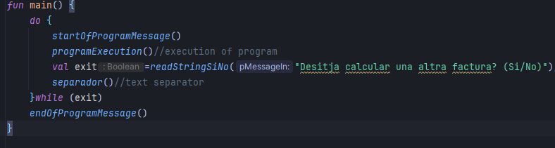
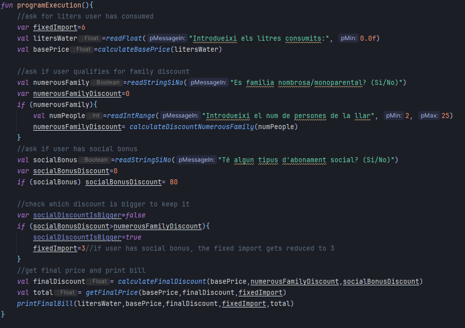

# Factura de l'Aigua 💧

Aquest és un programa que calcula la teva factura de l'aigua, partint del consum d'aigua de l'usuari i aplicant descomptes socials, taxa de manteniment, etc... Finalment es rep una factura desglossada.

## Índex

1. [Descripció](#Descripció)
2. [Que trobaràs](#Que-trobaràs)
3. [Sneak-Peak](#Sneak-Peak)
4. [Funcions de càlcul](#Funcions-de-càlcul)

## Descripció ☝️😎

En entrar al programa, salta un missatge de benvinguda, i es pregunta a l'usuari una sèrie de questions que afectaran el preu final. Entre aquests factors que modulen el preu trobem:

- Consum de litres d'aigua
- Descompte per família nombrosa o monoparental
- Descompte per bonificació social
- Taxa de manteniment

## Que trobaràs

- [src/main/kotlin/Main.kt](src/main/kotlin/Main.kt) Execució principal
- [src/main/kotlin/FunctionFactura.kt](src/main/kotlin/FunctionsFactura.kt) Functions de Càlcul
- [src/main/kotlin/Messages.kt](src/main/kotlin/Messages.kt) Funcions de missatges
- [src/main/kotlin/Utilities.kt](src/main/kotlin/Utilities.kt) Funcions de validació de dades
- [src/main/kotlin/consoleColors.kt](src/main/kotlin/consoleColors.kt) Constants d'impressio per consola a color

## Sneak-Peak 👀

#### Codi de main()

#### Codi de programExecution()
>[!NOTE]
>Aquesta és la funció que recopila la major part de l'execució

## Funcions de càlcul 🤠

### `calculateBasePrice()`
### `calculateDiscountNumerousFamily(`
### `calculateFinalDiscount()`
### `calculateFinalPrice()`

- Autora:Anna Cano
- Data: 11/01/24

